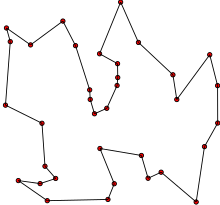

# Route Optimization
## Project Objectives
Route optimization helps in improving the efficiency of operations. With streamlined routes, drivers can complete more deliveries or service calls in less time. This increased productivity can lead to higher customer satisfaction and profitability. Route optimization also allows for better use of resources: it can help in effectively managing the fleet and reducing the need for additional vehicles or drivers. To meet this demand, many companies offer optimization solutions through apps and APIs that seamlessly integrate with business operations. 

As a former data analyst intern in an e-commerce platform's logistics division, I developed a keen interest in implementing ML model in this field. I aim to delve into these mechanisms and try to solve some common problems with small set of data.

## Techniques
- Dijkstra's algorithm: This algorithm is used to determine the shortest paths between nodes within a weighted graph. It's particularly effective for optimizing routing and navigation problems by identifying the most efficient routes between points.
- OR-Tools: OR-Tools is a comprehensive optimization package developed by Google. It encompasses a range of functions for setting up optimization environments, defining business constraints, and implementing various optimization strategies. It's a versatile tool used in fields like logistics, scheduling, and resource allocation to find optimal solutions to complex problems.
- Map visualization package: Folium is a powerful tool for visualizing geospatial data on interactive maps. It provides a user-friendly interface to create maps with custom markers, overlays, and layers, making it ideal for displaying geographical information and analyzing spatial relationships.
- Map information package: OSMnx is a package designed for retrieving, constructing, and analyzing street networks and other spatial data from OpenStreetMap. It's particularly useful for extracting detailed map information, such as street networks, building footprints, and elevation data, which can be leveraged for various geographical analyses and visualizations.

## Common Routing Optimization Problems and Solutions
These represent several typical routing optimization challenges. Variations stem from these fundamentals but entail different and more intricate objectives.
### Shortest Distance or Traveling Time
The most straightforward problem is to find the shortest route from point A to point B, with the objective function based on either geographical distance or travel time. This scenario does not include additional obstacles or requirements, such as passing through point C or starting or ending at a specific node.

Dijkstra's algorithm is commonly used to solve this problem. It works by selecting the unvisited vertex with the lowest distance, then calculating the distance through it to each unvisited neighbor and updating the neighbor's distance if it's smaller. This process continues until the shortest path from A to B is determined. 

The algorithm and scenario can be implemented under the assumption that each location is connected by a direct road, disregarding red lights, stop signs, toll roads, and other obstructions. This simplification allows for a straightforward calculation of the shortest route based solely on geographical distance or travel time.

Here's an example of how the algorithm works in practice. Let's say we want to determine the shortest route from node 1 to node 9. The main loop of the algorithm operates as follows:

1. Begin by visiting each node starting from the vertex with the smallest known distance from the start node. Initially, this will be the origin (node 1).
2. For the current vertex being visited, examine its neighboring nodes that haven't been visited yet.
3. Calculate the distance from each unvisited neighboring node to the start node. For instance, starting from node 1, we would calculate the distances from 1 to 2 as 2, from 1 to 3 as 5, and from 1 to 4 as 2.
4. If the calculated distance is shorter than the known distance, update the shortest distance.
5. Update the previous vertex for each updated shortest distance.
6. Add the current vertex to the list of visited vertices.
This loop continues until all vertices have been visited.

### Vehicle Routing Problem 
Vehicle routing problem is a generic name given to a whole class of problems concerning the optimal design of routes to be used by a fleet of vehicles to serve a set of customers. This becomes more complex as we include more factors like vehicle capacity and driver availability. For example, in a delivery company, it asks for a determination of a set of routes, S, (one route for each vehicle that must start and finish at its own depot) such that all customers' requirements and operational constraints are satisfied and the objective function is minimized or maximized.

Different variants of Vehicle Routing Problems include:  
1. Capacitated Vehicle Routing Problem: Vehicles have limited carrying capacity for the goods they must deliver.
2. Vehicle Routing Problem with Time Windows: Delivery locations have specific time windows within which deliveries must be completed.
3. Vehicle Routing Problem with Pickup and Delivery: Goods need to be transported from pickup locations to delivery locations.
4. Vehicle Routing Problem with Profits: Vehicles are not obligated to visit all nodes; the objective is to maximize the total collected profits.

With different business constraints and background The objective function can also be very different depending on the particular application of the result but a few of the more common objectives are:
1. Minimize the global transportation cost based on the global distance travelled as well as the fixed costs associated with the used vehicles and drivers
2. Minimize the number of vehicles needed to serve all customers
3. Least variation in travel time and vehicle load
4. Minimize penalties for low quality service
5. Maximize a collected profit/score.

Here are some optimization algorithm commonly used in solving vehicle routing problem:
1. Genetic Algorithms (GA): they search problems by mimicking the principles of evolution and natural selection observed in biological systems. They start with random strategies and solutions, assess their fitness, then allow the best ones to combine strategies, akin to how animals pass traits to offspring. Introducing randomness via mutation, like new traits arising in living things, adds diversity. This cycle repeats over generations, making solutions smarter and more optimized, similar to how species adapt over time to their environments.

2. Neighborhood search algorithms: these algorithms work by iteratively exploring the neighborhood of a current solution to find improved solutions. It explore small changes (neighborhoods) from your current solution and moving towards better solutions within that neighborhood. They're great for problems where you want to find the best solution by making incremental improvements step by step.

3. Simulated Annealing (SA): it is similar to neighborhood search algorithms, but it adds a "temperature" parameter. This temperature controls how much randomness is allowed in the search. Starting with a high temperature enables extensive exploration and random movements across the solution space. As the algorithm progresses through iterations, the temperature gradually decreases following a predefined cooling schedule. This cooling process makes the algorithm more deterministic, meaning it becomes less likely to accept worse solutions as it progresses. The algorithm stops either when it reaches the maximum number of iterations or when a termination condition is met.

4. Ant Colony Optimization (ACO): it mimics ants' pheromone-based communication to find optimal paths. Artificial ants randomly explore solutions, choosing paths based on pheromone levels and heuristics. Higher pheromone levels and shorter paths are favored. ACO updates pheromone information iteratively, using historical data to guide exploration, unlike neighborhood search algorithms that focus narrowly on immediate solutions.

### Traveling Salesman Problem
The Traveling Salesman Problem (TSP) is a specific type of routing vehicle problem that focuses on finding the shortest possible route for a salesman who needs to visit a list of cities exactly once and return to the starting city. The goal is to find the most efficient route that allows the salesman to visit every city exactly once and return to the city where they started their journey. This problem is crucial in logistics, transportation planning, and optimizing travel routes.

It's important to note that as the number of cities increases in the Traveling Salesman Problem, the sheer number of possible routes grows exponentially, posing a significant challenge for finding the optimal solution. To address this challenge, a range of optimization algorithms are employed, including heuristic approaches like nearest neighbor algorithms, genetic algorithms, simulated annealing, and ant colony optimization. These algorithms employ diverse strategies to progressively enhance the route by analyzing subsets of cities and assessing potential routes based on factors such as total distance or time.

## Projects
The notebook attached will showcase some examples of dealing with these kinds of optimization problems with actual dataset.

